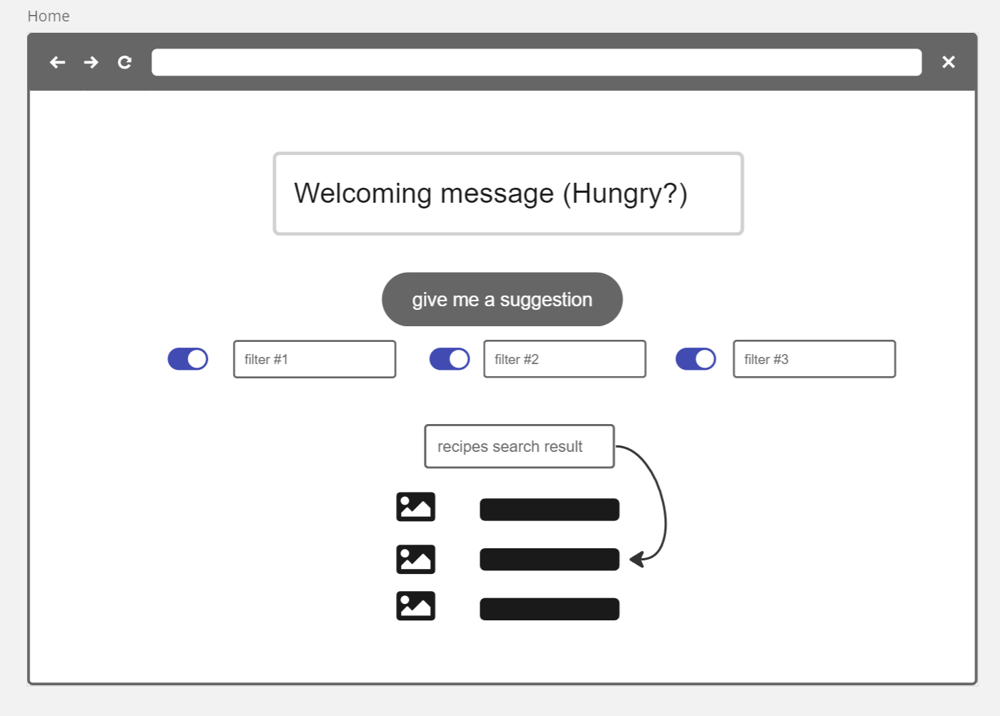
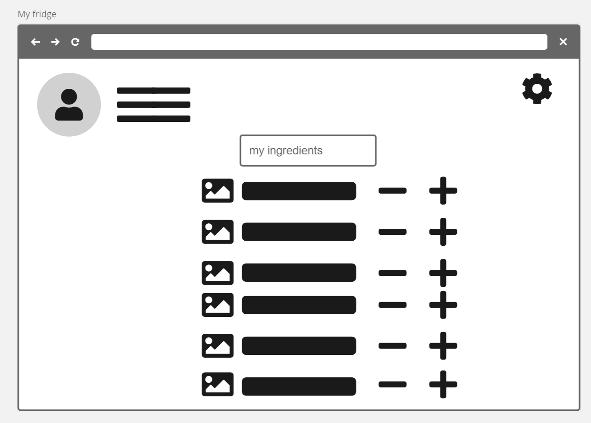
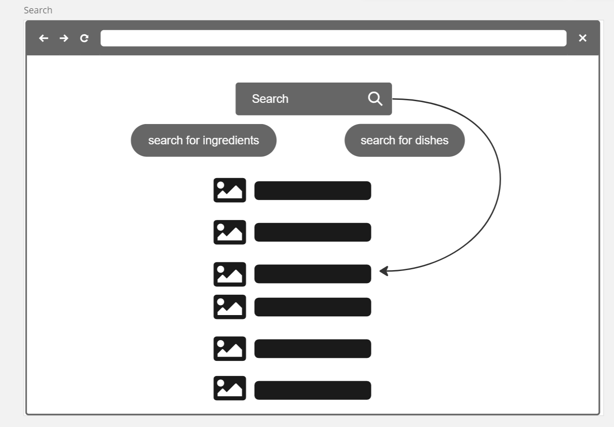

## My Fridge

A website that helps you to keep track of ingredients in your house and gives you a meal suggestion based on the current ingredients you have in your inventory

### Home Page

here you receive a welcoming message and an option to get a meal suggestion based on your inventory
### My Fridge Page

here you can see a list of ingredients you currently have plus you can edit the amount of each ingredient 
### Search Page

here you can specifically search for an ingredient or a dish you want

API we will be using:

1. search for Recipes based on the name: https://spoonacular.com/food-api/docs#Search-Recipes-Complex
2. search for Recipes based on ingredients: https://spoonacular.com/food-api/docs#Search-Recipes-by-Ingredients.

   https://www.priceapi.com/
   
   sheeesh
   
   no 4
   
